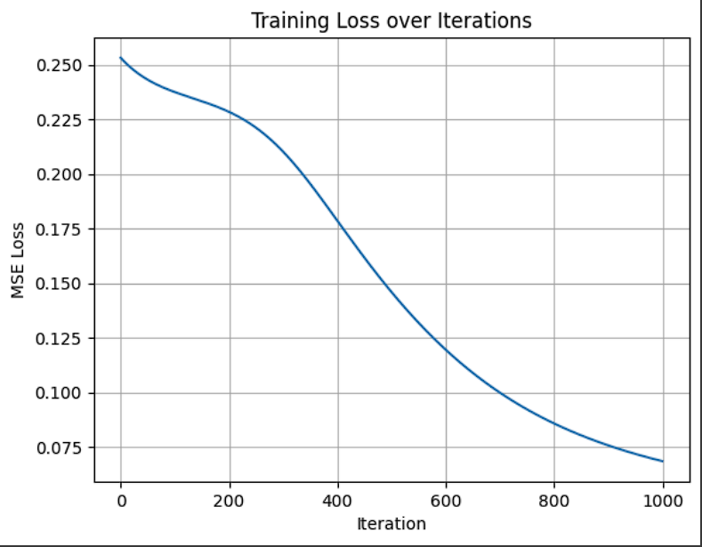
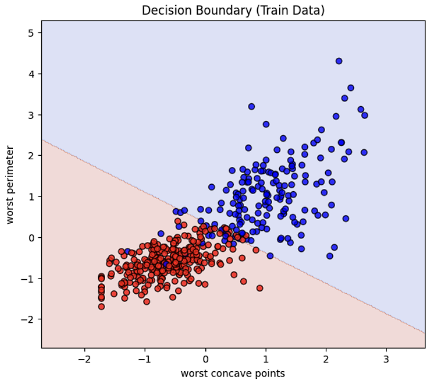

# 🧠 Neural Network From Scratch (Python + NumPy)

## Members
- CHRISTIAN DAVE JANIOLA  
- HUSSAM BANSAO  
- NATHANIEL BALANAY

---

## 📘 Overview
This project builds a simple **neural network from scratch** using only **Python and NumPy** — no TensorFlow, PyTorch, or other machine learning libraries.  
It classifies **breast cancer tumors** as malignant or benign using two of the most correlated features from the dataset.

---

## 🧩 Dataset
- **Source:** [Scikit-learn Breast Cancer Dataset](https://scikit-learn.org/stable/modules/generated/sklearn.datasets.load_breast_cancer.html)
- **Classes:**  
  - `0` → Malignant  
  - `1` → Benign

### Features Used
Based on correlation analysis, the top two features were chosen for training and visualization:
- `worst concave points`
- `worst perimeter`

These are selected in the code:
```python
feat1 = 'worst concave points'
feat2 = 'worst perimeter'
```
## Network Architecture

- Input layer: 2 neurons (the two selected features)

- Hidden layer: 4 neurons (activation: ReLU)

- Output layer: 1 neuron (activation: Sigmoid)

- Loss function: Mean Squared Error (MSE)

- Optimizer: Gradient Descent

- Iterations: 1000

## Implementation Details
Implemented manually:

- Random weight and bias initialization

- Forward propagation (ReLU → Sigmoid)

- Mean Squared Error loss

- Backpropagation (manual gradient computation)

- Training performed for 1000 iterations.

- Parameter updates using gradient descent

- Visualization of training loss and decision boundary


## Visualization:

- Training loss plot


- Decision boundary (for 2D inputs)


## Results

Train accuracy: `0.941`, Test accuracy: `0.947`

Loss/Train acc/Test acc per hundred iterations:
```
Iter 100/1000 - Loss: 0.23750 | Train acc: 0.626 | Test acc: 0.632
Iter 200/1000 - Loss: 0.22846 | Train acc: 0.626 | Test acc: 0.632
Iter 300/1000 - Loss: 0.21034 | Train acc: 0.626 | Test acc: 0.632
Iter 400/1000 - Loss: 0.17883 | Train acc: 0.626 | Test acc: 0.632
Iter 500/1000 - Loss: 0.14613 | Train acc: 0.626 | Test acc: 0.632
Iter 600/1000 - Loss: 0.11970 | Train acc: 0.932 | Test acc: 0.939
Iter 700/1000 - Loss: 0.10001 | Train acc: 0.941 | Test acc: 0.956
Iter 800/1000 - Loss: 0.08588 | Train acc: 0.938 | Test acc: 0.947
Iter 900/1000 - Loss: 0.07582 | Train acc: 0.934 | Test acc: 0.947
Iter 1000/1000 - Loss: 0.06857 | Train acc: 0.941 | Test acc: 0.947
```
## Team Collaboration

- Janiola, Balanay, Bansao:
  - Weight and bias initialization
  - Forward propagation coding
  - Loss function implementation
  - Backpropagation and gradient computation
  - Training loop and visualization
- Janiola
  - Video and Presentation


## Requirements / How to run
- Make sure you have: `pip install numpy matplotlib scikit-learn seaborn pandas
`
- Run the notebook
  - Open the .ipynb notebook (or paste into Google Colab) and run all cells.

## Summary

This activity helped us gain a deeper understanding of how a neural network operates internally without relying on high-level machine learning frameworks.
We collaboratively built the model, analyzed its training performance, and visualized its decision-making process.

## Video Presentation: https://drive.google.com/file/d/1AOnWxhVvQt7RBUc2C7mhcvFJbsJHPUhF/view?usp=sharing